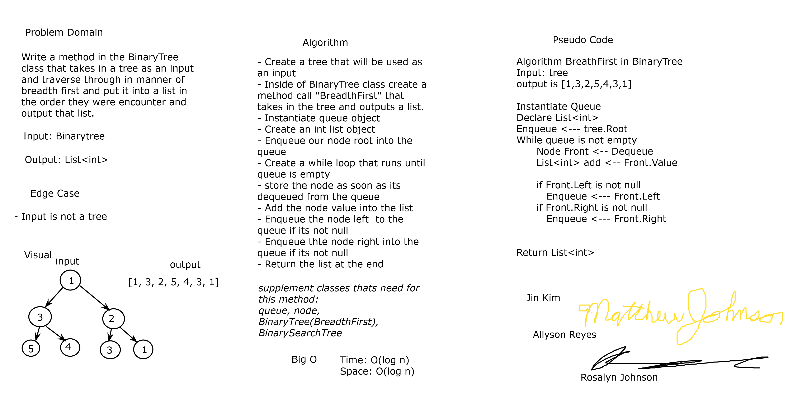

# ***Code Challenge 17***
------------------------------

# Fizz Buzz Trees.
##### *Authors: Jin Kim and Matthew Johnson*

------------------------------

## Description
Console application that creates a method that takes in a binary tree a tree with list with values in the correct order.
------------------------------

## Getting Started
Clone this repository to your local machine.
```
$ git clone [https://github.com/SEAsouthern/dotNET-data-structures-and-algorithms.git]
```
#### To run the program from Visual Studio:
Select ```File``` -> ```Open``` -> ```Project/Solution```

Next navigate to the location you cloned the Repository.

------------------------------

## Visuals


##### WhiteBoard




##### Using the Application

##### Application End


------------------------------
## Approach & Efficiency


### Big O
Log(n)

## Change Log
0.1 Added Whiteboard. 
