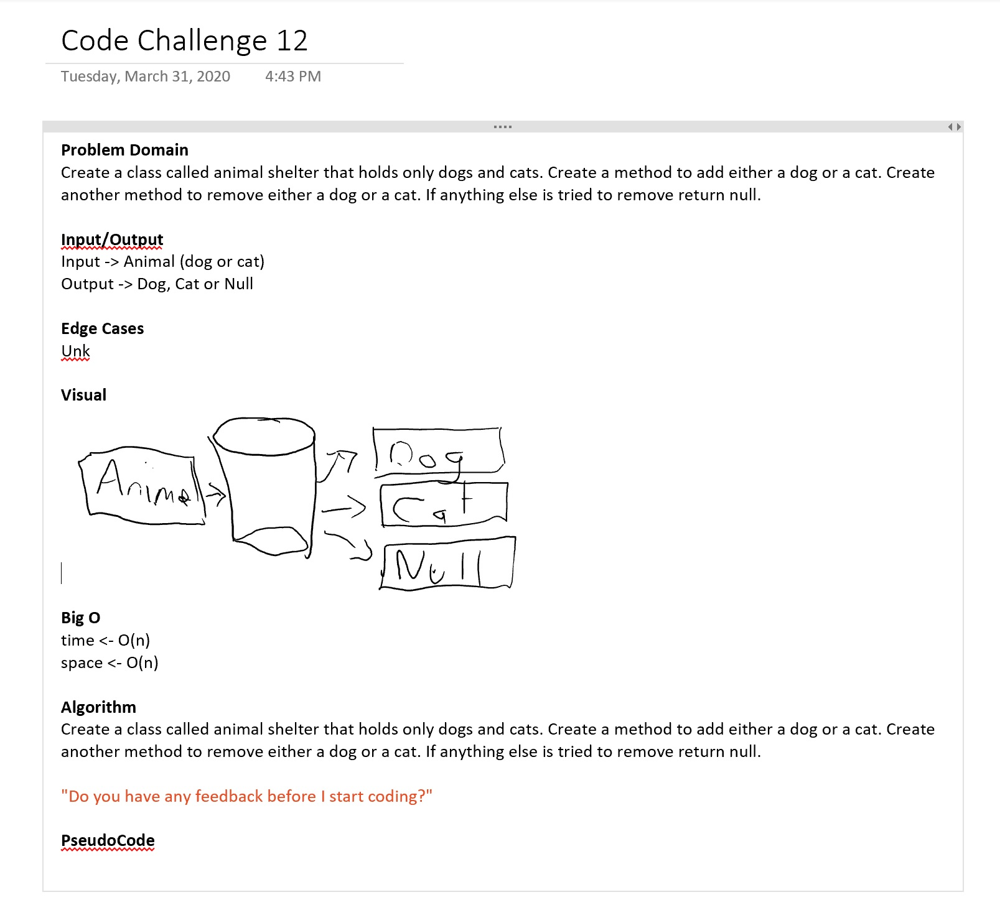

# ***First-in, First out Animal Shelter.***
------------------------------

# First-in, First out Animal Shelter.
##### *Author: Matthew Johnson*

------------------------------

## Description
Console application that creates a class called animal shelter that holds only dogs and cats. Create a method to add either a dog or a cat. Create another method to remove either a dog or a cat. If anything else is tried to remove return null.

------------------------------

## Getting Started
Clone this repository to your local machine.
```
$ git clone [https://github.com/SEAsouthern/dotNET-data-structures-and-algorithms.git]
```
#### To run the program from Visual Studio:
Select ```File``` -> ```Open``` -> ```Project/Solution```

Next navigate to the location you cloned the Repository.

------------------------------

## Visuals


##### WhiteBoard




##### Using the Application

##### Application End


------------------------------
## Approach & Efficiency


### Big O

## Change Log
0.1 Added Whiteboard. 
