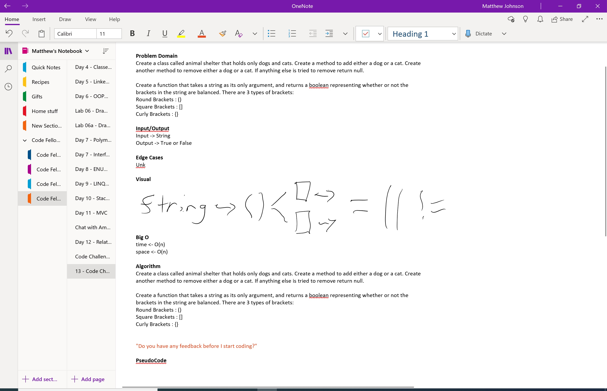

# ***Multi-bracket Validation.***
------------------------------

# Multi-bracket Validation.
##### *Author: Matthew Johnson*

------------------------------

## Description
Console application that creates a function that takes a string as its only argument, and returns a boolean representing whether or not the brackets in the string are balanced. There are 3 types of brackets:
Round Brackets : ()
Square Brackets : []
Curly Brackets : {}

------------------------------

## Getting Started
Clone this repository to your local machine.
```
$ git clone [https://github.com/SEAsouthern/dotNET-data-structures-and-algorithms.git]
```
#### To run the program from Visual Studio:
Select ```File``` -> ```Open``` -> ```Project/Solution```

Next navigate to the location you cloned the Repository.

------------------------------

## Visuals


##### WhiteBoard




##### Using the Application

##### Application End


------------------------------
## Approach & Efficiency


### Big O

## Change Log
0.1 Added Whiteboard. 
